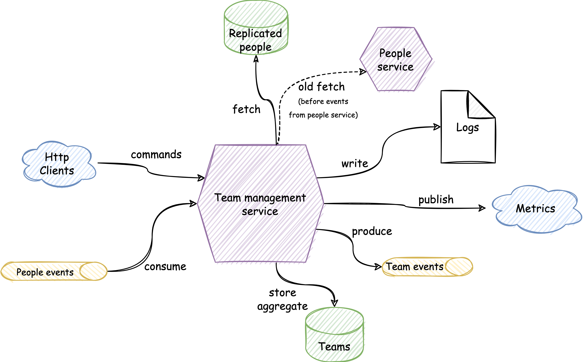

# team-mgmt-service

## Description

Team management service is a production ready and fully tested service that can be used as a template for a microservice 
development.

Keywords: `microservice`, `kotlin`, `Hexagonal-Architecture`, `SOLID`, `Domain-Driven Design`, `functional-programming`, 
`Testing`, `Event-Driven Architecture`, `Domain-Events`, `Kafka`, `spring-boot`, `PostgreSQL`, `Transactional-outbox`

## Overview

  

## Use-cases

- Create a team
- Add person as a team member
- Remove person as a team member

### Use-case diagram

Example of how a use-case looks like:

  

## Architectural Patterns

This project has been built using **[hexagonal architecture](https://alistair.cockburn.us/hexagonal-architecture/) (aka [ports & adapters](https://jmgarridopaz.github.io/content/hexagonalarchitecture.html))**, a domain-centric architectural pattern that use
**[dependency inversion](https://blog.cleancoder.com/uncle-bob/2016/01/04/ALittleArchitecture.html)** as main principle behind. It also uses **tactical DDD patterns** in the domain layer.

### Package structure

- Application: Application Services (the use cases)
- Domain: Domain model and ports.
- Infrastructure: Adapters, configuration and infrastructure code.

### Architectural shortcuts

Even though the project follows hexagonal architecture, it also takes some shortcuts, breaking consciously
some architectural constraints:

- **Skipping incoming ports**: Incoming adapters are accessing application services directly.

## Messaging patterns

In order to avoid [dual writes](https://thorben-janssen.com/dual-writes/) the project uses a couple of patterns:
- [transactional-outbox](https://microservices.io/patterns/data/transactional-outbox.html)
- [polling-publisher](https://microservices.io/patterns/data/polling-publisher.html)

## Events

### Domain events

A Domain-event is something that happened in the domain that is important to the business.

This service advocates for asynchronous communication instead of exposing endpoints to be consumed by clients. To do so 
, since the service uses also domain-driven design tactical patterns, all use-cases are producing domain-events:
- [Team Created](/src/main/kotlin/com/teammgmt/domain/model/DomainEvents.kt)
- [Team Member Joined](/src/main/kotlin/com/teammgmt/domain/model/DomainEvents.kt)
- [Team Member Left](/src/main/kotlin/com/teammgmt/domain/model/DomainEvents.kt)

### Integration events

An integration event is a committed event that ocurred in the past within a bounded context which may be interesting to other
domains, applications or third party services, so it is the sibling of a domain event but for the external world.

Why not to publish our domain events directly? We can not publish our domain events directly for several reasons:
- Back-ward compatibility: We should provide a way to maintain backward compatibility, if we were publishing our domain events we would couple them to the external contracts.
- Different schema for messages: In almost all the companies using event-driven these messages are defined in a different schema such as avro, protobuf or json schema.
- We don't want to publish all domain-events: Sometimes we don't want to publish to our consumers all our internal domain events.

Here the [contracts](/src/main/kotlin/com/teammgmt/infrastructure/adapters/outbound/event/IntegrationTeamEvents.kt)

