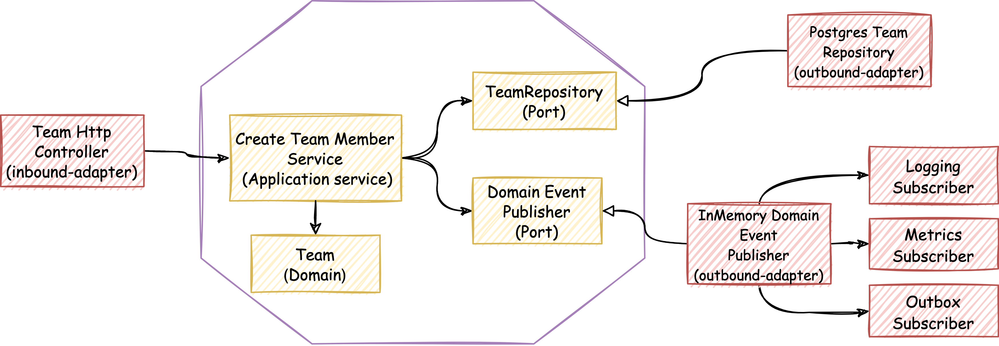

# team-mgmt-service

## Description

Team management service is a production ready and fully tested service that can be used as a template for a microservice 
development.

Keywords: `microservice`, `kotlin`, `Hexagonal-Architecture`, `Domain-Driven Design`, `functional programming`, `Testing`, 
`Event-Driven Architecure`, `Domain events`, `Kafka`, `spring-boot`, `PostgreSQL`, `Transactional-outbox`

## Overview

  

## Use-cases

- Create a team
- Add person as a team member
- Remove person as a team member

### Use-case diagram

  

## Architectural Patterns

This project has been built using **[hexagonal architecture](https://alistair.cockburn.us/hexagonal-architecture/) (aka [ports & adapters](https://jmgarridopaz.github.io/content/hexagonalarchitecture.html))**, a domain-centric architectural pattern that use
**[dependency inversion](https://blog.cleancoder.com/uncle-bob/2016/01/04/ALittleArchitecture.html)** as main principle behind. It also uses **tactical DDD patterns** in the domain layer.

### Package structure

- Application: Application Services (the use cases)
- Domain: Domain model and ports.
- Infrastructure: Adapters, configuration and infrastructure code.

### Architectural shortcuts

Even though the project follows hexagonal architecture, it also takes some shortcuts, breaking consciously
some architectural constraints:

- **Skipping incoming ports**: Incoming adapters are accessing application services directly.

### Messaging patterns

In order to avoid [dual writes](https://thorben-janssen.com/dual-writes/) the project uses a couple of patterns:
- [transactional-outbox](https://microservices.io/patterns/data/transactional-outbox.html)
- [polling-publisher](https://microservices.io/patterns/data/polling-publisher.html)

# Error handling

- recoverable: Domain (Eithers)
- Not recoverable: Let it crash (Exceptions, capture and deal with them at the boundary of the app)

boundary errors (shit happens)
kafka retries

where are the metrics! boundary monitoring

Diagram testing

testing strategy

diagram usecases etc ...

Flyway

What about reading entrypoint???????? events, compacted topic!!! 

## tech-stack
spring boot
undertow (nio)
kafka
postgresql
kotlin
arrow
BBDD: postgresql, flyway, jdbctemplate

## DDD patterns
aggregate

-tactical ddd
- ddd related patterns
- domain events
  domaineventpublisher
  outbox, simple implementation explain and links (copy from Tn or check history).
  dual writes (logs, metrics is ok), kafka no:
  https://github.com/n26/spring-transactional-outbox

eventual consistency

eda:
- dual writes
- DLQ
- tombstones
- Error handling Kafka : backoff, retries and error handling (revover)
- Replication, fallback when lag more than 5 min ?
- dual writes

