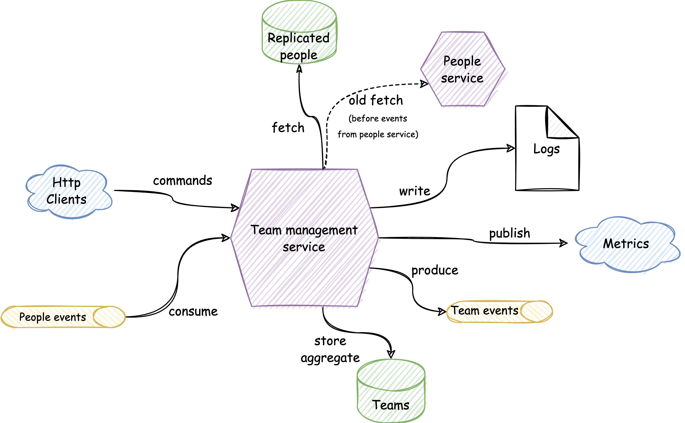
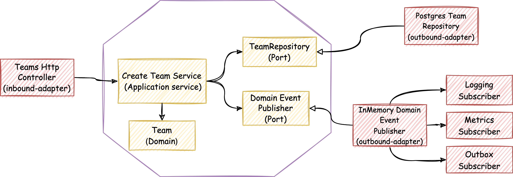

# team-mgmt-service

## Description

Team management service is a production ready and fully tested service that can be used as a template for a microservice 
development.

Keywords: `microservice`, `kotlin`, `Hexagonal-Architecture`, `SOLID`, `Domain-Driven Design`, `functional-programming`, 
`Testing`, `Event-Driven Architecture`, `Domain-Events`, `Kafka`, `spring-boot`, `PostgreSQL`, `Transactional-outbox`

## Overview

  

## Use-cases

- Create a team
- Add person as a team member
- Remove person as a team member

### Use-case diagram

Example of how a use-case looks like:

  

## Architectural Patterns

This project has been built using **[hexagonal architecture](https://alistair.cockburn.us/hexagonal-architecture/) (aka [ports & adapters](https://jmgarridopaz.github.io/content/hexagonalarchitecture.html))**, a domain-centric architectural pattern that use
**[dependency inversion](https://blog.cleancoder.com/uncle-bob/2016/01/04/ALittleArchitecture.html)** as main principle behind. It also uses **tactical DDD patterns** in the domain layer.

### Package structure

- Application: Application Services (the use cases)
- Domain: Domain model and ports.
- Infrastructure: Adapters, configuration and infrastructure code.

### Architectural shortcuts

Even though the project follows hexagonal architecture, it also takes some shortcuts, breaking consciously
some architectural constraints:

- **Skipping incoming ports**: Incoming adapters are accessing application services directly.

### Messaging patterns

In order to avoid [dual writes](https://thorben-janssen.com/dual-writes/) the project uses a couple of patterns:
- [transactional-outbox](https://microservices.io/patterns/data/transactional-outbox.html)
- [polling-publisher](https://microservices.io/patterns/data/polling-publisher.html)
